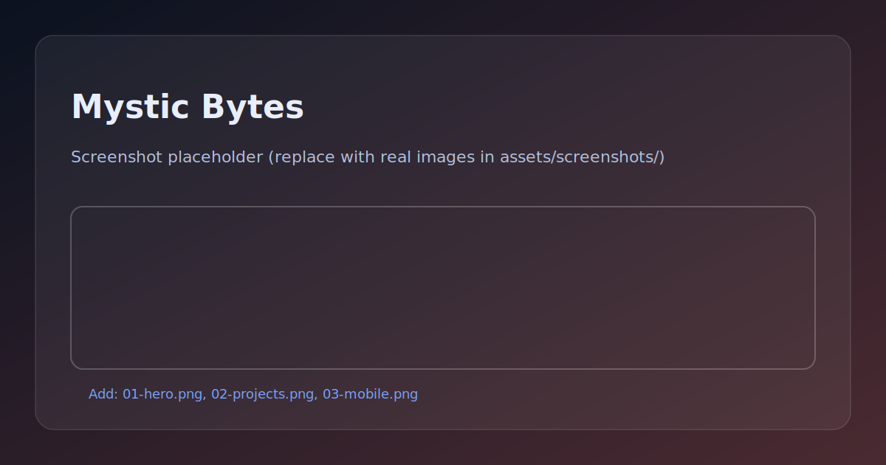

# Mystic Bytes

Personal resume / portfolio site (Jekyll) published via GitHub Pages.

---

## 🖼️ Preview



> Replace this placeholder by adding real screenshots to `assets/screenshots/` (see `samples/capture-screenshots.md`).

---

## Live site
- `https://www.arcaneglam.com` (configured via `CNAME`)

### 💡 At a glance
- **Stack:** Jekyll + GitHub Pages
- **Goal:** fast, readable, recruiter-friendly portfolio site

---

## Local development
```bash
bundle install
bundle exec jekyll serve
# open http://127.0.0.1:4000
```

---

## Demo samples
See `samples/` for a short walkthrough script and Copilot prompt ideas.
